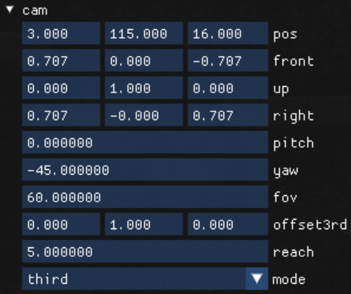

[Reflection](https://en.wikipedia.org/wiki/Reflection_(computer_programming)), specifically type introspection, is an immensely useful feature common in modern languages. By providing a way to inspect the properties of types, for example, the members of an arbitrary data structure, introspection allows one to write much more general and effective generic code, enforce interfaces/contracts, and more. 

Though most obviously useful in dynamic languages, introspection is just as powerful in compiled, statically typed languages such as [Go](https://blog.golang.org/laws-of-reflection) and [JAI](https://www.youtube.com/watch?v=JoNkttD_MUs). Unfortunately, C++ does not support run-time reflection as a language feature, and template-based compile-time reflection is neither standardized, elegant, nor robust. Standards proposals have been put forward to add reflection features, but an implementation is still rather far off. Further, [libraries](https://github.com/rttrorg/rttr) aiming to provide run-time reflection typically require laborious setup for each type you wish to make reflect-able. 

For [exile](https://github.com/TheNumbat/exile), I wanted to use run-time reflection to power truly type-agnostic serialization and UI, but I did not want the code overhead of specifying meta-info for all of my types. Inspired by JAI's model, I chose to implement a library-level reflection system via metaprogramming. Combined with exile's [hot reloading system](https://thenumbat.github.io/Hot-Reloading-in-Exile/), I find the environment very conducive to iteration and prototyping&mdash;even in a very C-like dialect of C++.

## Usage

The end result allowed me to write code such as this, to print any structure:  
<em>(Simplified. ``print_type`` can print any type, not just structures)</em>

```c++
template<typename T>
void print_struct(T value) { 
	
	uint8_t* addr = &value;
	_type_info* info = TYPEINFO(T);

	print(info->name);
	
	print('{');
	for(int i = 0; i < info->_struct.member_count; i++) {

		print(info->_struct.member_names[i]);
		print(" : ");

		uint8_t* member_addr = addr + info->_struct.member_offsets[i];
		_type_info* member_type = TYPEINFO_H(info->_struct.member_types[i]);

		print_type(member_addr, member_type);

		if(i < info->_struct.member_count - 1) {
			print(", ");
		}
	}
	print('}');
}
```
Usage:

```c++

struct inner {
	int i = 10;
	float f = 10.0f;
};

struct outer {
	string name = "Data!";
	inner data;
};

outer o;
print(o);

```
Result:

```
outer{name : "Data!", data : inner{i : 10, f : 10.0}}
```

## Structure

The reflection system relies on a global (thread-local) table that contains all type information. This is a simple hash map that maps from ``type_id`` to ``_type_info``, which is a discriminated union containing the type's size, name, type (that is, integer, floating point, pointer, structure, etc.), and associated information, such as member values and names.  
<em>(Simplified)</em>

```c++
enum class Type : uint8_t {
	_void,
	_int,
	_float,
	_ptr,
	_struct,
	// ...array, enum, etc...
};

struct Type_void_info {};
struct Type_int_info {
	bool is_signed = false;
};
struct Type_float_info {};
struct Type_bool_info {};
struct Type_ptr_info {
	type_id to = 0;
};
struct Type_struct_info {
	type_id		member_types[96]	= {};
	string 		member_names[96];
	uint32_t 	member_offsets[96]	= {};
	uint8_t 	member_circular[96] = {};
	uint32_t 	member_count		= 0;
};

struct _type_info {
	
    Type type_type 	= Type::_void;
    type_id hash;

    uint64_t size   = 0;
    string name;

	union {
		Type_void_info	 _void;
		Type_int_info    _int;
		Type_float_info  _float;
		Type_bool_info   _bool;
		Type_ptr_info    _ptr;
		Type_struct_info _struct;
	};
};
```

A ``type_id`` is easily derived from C++'s built-in ``typeid`` operator using ``hash_code()``. Technically, ``hash_code()`` is not garmented to never collide, so ``std::type_index()`` is the more robust option. I have not had a problem using ``hash_code()``, however. Note that because ``typeid`` is only ever used on compile-time known types (that is, not polymorphic objects), this code works properly with [RTTI](https://www.geeksforgeeks.org/g-fact-33/) disabled, which I compile without. 

```c++
// ...last example...

map<type_id,_type_info> type_table;

template<typename T>
struct _get_type_info { 
	
	static _type_info* get_type_info() {

		return type_table.try_get(typeid(T).hash_code());
	}
};

#define TYPEINFO(...) _get_type_info< __VA_ARGS__ >::get_type_info()    // get by compile-time type
#define TYPEINFO_H(h) type_table.try_get(h)                             // get by hash
```

Providing the ``TYPEINFO()`` syntax requires a bit of macro trickery via varargs to group incorrectly comma-delinated template types and a static member function that can be arbitrary specialized.

Getting information for pointers is slightly more complicated: there's no limit on how many different types of pointers that exist, so we can't populate the table with all of them! Instead, we automatically generate and add a ``_type_info`` when a type of pointer is requested that we haven't seen before. This is possible because using [SFINAE](https://en.wikipedia.org/wiki/Substitution_failure_is_not_an_error), we can extract the pointed-to type of a request, and set our pointer ``_type_info`` to refer to the correct entry in the type table. Because getting the information for an underlying type is a recursive process, this automatically works for multiple indirections: requesting an ``int**`` will create an entry for ``int**`` that refers to a new entry ``int*`` which refers to ``int``.

```c++
// ...last example...

template<typename T>
struct _get_type_info<T*> {

	static _type_info* get_type_info() {

		_type_info* info = type_table.try_get(typeid(T*).hash_code());
		if(info) return info;

		_type_info* to = TYPEINFO(T);

		_type_info ptr_t;
		
		ptr_t.type_type = Type::_ptr;
		ptr_t.hash 		= typeid(T*).hash_code();

		ptr_t.size 		= sizeof(T*);
		ptr_t.name 		= to->name;
		
		ptr_t._ptr.to 	= to->hash;
		
		return type_table.insert(ptr_t.hash, ptr_t);
	}
};
```

Fully built out, along with some utility functions such as enum-stringification and any-width integer load/store, this straightforward system is all that is needed to preform very powerful introspection operations. For example, custom UI elements for any type:

```c++
ImGui::EditAny("settings", &settings);
```


## Metaprogramming

### libclang

## Limitations

## Future
