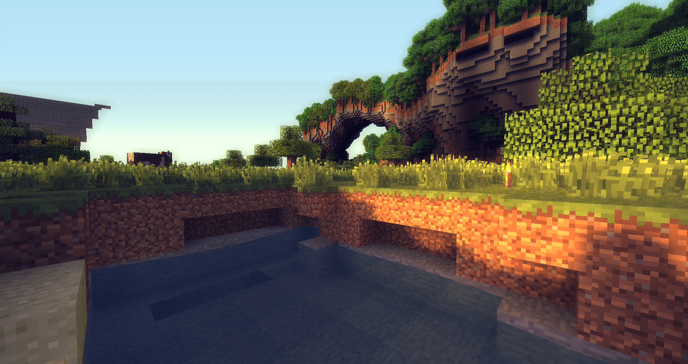
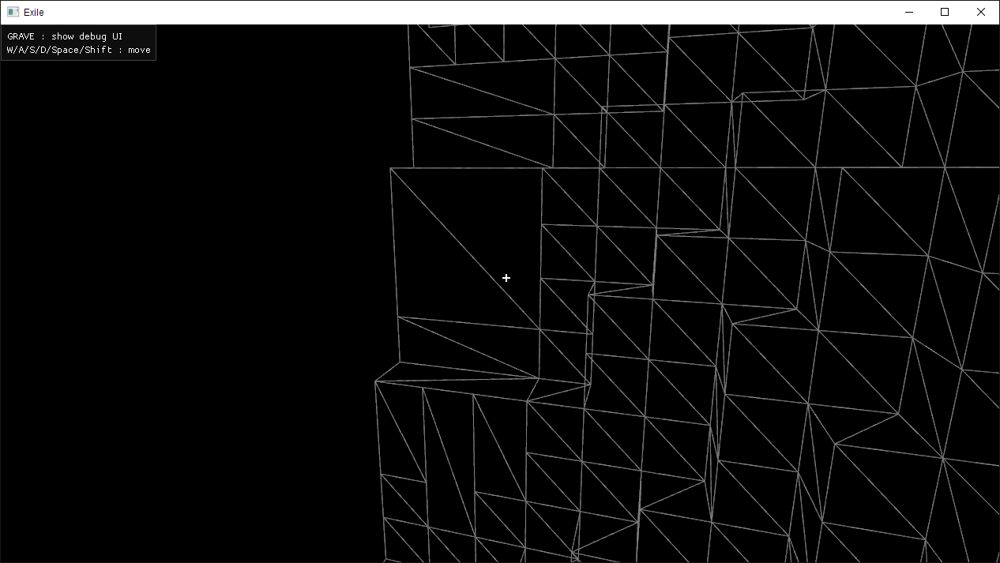
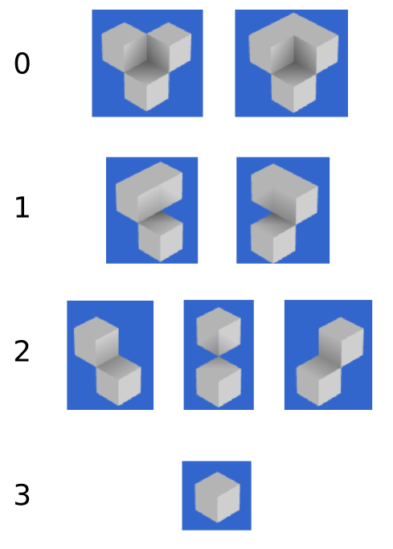
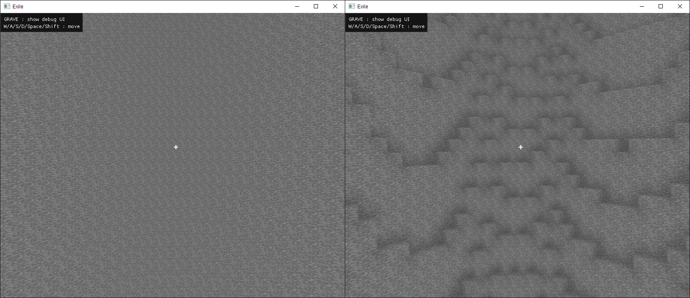

No, [Exile](https://github.com/TheNumbat/exile) is not technically a "voxel" engine. A real voxel engine unifies objects, textures, and more into colored voxel data, rendering them via raymarching/[marching cubes](https://en.wikipedia.org/wiki/Marching_cubes)/[dual contouring](https://upvoid.com/devblog/2013/05/terrain-engine-part-1-dual-contouring/)/etc., and can target realism. Instead, Exile is a "voxel" engine in that it's a traditional 3D engine that happens to focus on representing and drawing textured cubes (like Minecraft and related games). Some have worked around this linguistic confusion by christening the technique ["Swedish cubes"](https://yave.handmade.network/), but for the purposes of this post, please assume that voxels imply textured cubes.

## Voxels

Representing a game world with voxels provides several distinct advantages:

Interactivity: Voxels provide an obvious way for the player to build, edit, and destroy the world however they wish.

Systems: Having a natural world grid allows procedural generation, NPCs, logistic systems, and the like to seamlessly integrate into the environment.
	
Performance: Many optimizations (lighting, meshing, AO, culling, pathing, etc.) are available when working with voxel data, resulting in good performance scaling.

Aesthetics: Subjectively, voxel worlds can look better from farther distances than traditional mesh-based worlds, all while being more compact.

<div style="text-align: center;"></div>

Of course, voxels are not without some disadvantages:
- Not for realism, and can look unnatural when mixed with non-voxel elements.
- No [natural LOD](https://0fps.net/2018/03/03/a-level-of-detail-method-for-blocky-voxels/) algorithm (though [there is](http://transvoxel.org/) for marching cubes).
- Likely others I haven't run into.

So voxels are cool, but hasn't this already been done by Minecraft, Minetest, Creativerse, FortressCraft, etc? That's not even counting the many games that render voxel worlds with a non-cube asethetic. Well, maybe it has, but I believe there's work to be done in integrating the technical advancements of a variety of techniques, from user interaction and world generation to new representations and graphics techniques. 

One of the motivating factors for this project was frustration with the state of modded Minecraft: as complex and interesting as the game can be, it suffers from countless technical problems, performance bottlenecks, and compatibility issues, all of which could be solved under a new platform built with extensibility and performance as top priorities. This is my aspiration for Exile, but the project has also served as a learning experience: deciding to start from absolute scratch has led me to learn about the interconnected workings of everything in a 3D engine, from platform services to data structures to debug interfaces and voxel worlds.

## World

In Exile, the world is abstractly represented as an infinite (well, ``UINT32_MAX`` x ``UINT32_MAX`` x 511) field of blocks. Block queries can be made at any position in the world. Of course, there's not enough memory on the planet to store that much information, so the world is sparsely populated by 31 x 31 block chunks. When a chunk of the world is needed, for example, because the player is near enough to render it, it is either retrieved from the world (a hash map) or generated and added on-demand.

The following describes how Exile goes from one chunk of voxel data to rendering an output: more detail on how the world is generated, persisted, rendered, and edited will be published in a future post.

## Techniques  

I explored several techniques for rendering the voxel data, and have mostly settled on a hybrid solution.
1. Instancing

	This technique is the simplest and most obvious: instance a single cube mesh for each block you want to render. This works surprisingly well in the optimal case, a uniform checkerboard of blocks (meaning all faces must be rendered). However, given the massive overdraw in normal cases and lack of flexibility, this technique is not very useful in the end.

2. Geometry shaders

	Using geometry shaders to generate raster data encompasses a variety of options, including [generating entire blocks](http://jojendersie.de/rendering-huge-amounts-of-voxels/) (with up to three faces visible) and [generating triangles based on face data](https://yave.handmade.network/blogs/p/2629-compact_cube_meshes,_and_compact_cube_meshes_in_unity). These techniques tend to be the most space-efficient, but suffer in complexity and geometry shader performance.

3. Meshing

	Meshing also encompasses several techniques. The basic idea is to generate a traditional 3D mesh from voxel data. Rendering static meshes is just about the fastest thing a GPU can do, so meshing tends to be the most performant approach&mdash;but can require unacceptable amounts of GPU memory. However, memory limitations may be worked around by using fixed-precision attributes. For example, if all vertices are at integer coodinates within a chunk, the coordinates only need enough bits to cover the size of the chunk&mdash;certainly not a 12-byte vec3. Further, this approach can be combined with geometry shaders to render directly from an optimized mesh of whole-face data rather than triangle/vertex data.

I found the approach with the highest absolute performance to be meshing. However, due to memory and flexibility concerns, what I settled on for Exile is a hybrid meshing/geometry shading pipeline: generate an optimized face mesh for each chunk, then feed the mesh faces (each represented by four compact vertices) through shaders that unpack the vertices, assemble them into a quad, and render them. 

## Meshing

The first step in the voxel rendering pipeline is creating an optimized, render-able mesh from each chunk. This means converting from flat block data to a list of render-able faces. Exile uses a greedy meshing algorithm to both cull invisible faces and combine identical faces into larger blocks, greatly reducing the overall number of quads. Greedy meshing provides a good trade-off between creating compact meshes and latency in (re)generation. I highly recommend reading [this article](https://0fps.net/2012/06/30/meshing-in-a-minecraft-game/) for an exploration of the algorithm.

<em>([Implementation](https://github.com/TheNumbat/exile/blob/master/src/world.cpp#L735))</em>

<div style="text-align: center;"><p><em>Result of Greedy Meshing</em></p></div>

## Ambient Occlusion

Even without basic lighting, [ambient occlusion](https://en.wikipedia.org/wiki/Ambient_occlusion) can provide a reasonable level of definition in corners and facets. Ambient occlusion is very lightweight to implement in a static voxel world: on mesh generation, an occlusion value can be calculated at each vertex and baked into the mesh for the renderer to refer to.

There are four levels of occlusion possible for any vertex in the world, as shown here:

<div style="text-align: center;"><p><em>Credit <a href="https://0fps.net/2013/07/03/ambient-occlusion-for-minecraft-like-worlds/">0fps.net</a></em></p></div>

Notice that the occlusion value of the vertex is only dependent on the opacity of the three upper adjacent blocks (if all are filled, occlusion is always 0). Hence, for any vertex in the world, one can find which of the four blocks above the vertex is air, then calculate occlusion based on the other three (two sides and the corner). If both sides are filled, the point is maximally occluded, but otherwise, the occlusion is simply increased for each filled block.

```c++
if(side0 && side1) {
	return 0;
}
return 3 - side0 - side1 - corner;
```

Finally, once the 0-3 occlusion value is calculated for each vertex, the fragment shader must use this value to blend and darken the result. To do so, the shader can use the 0-3 value as an index into a uniform occlusion curve, multiplying the result by the specified occlusion factor. In Exile, the default curve is ``0.75, 0.825, 0.9, 1.0``. However, simply assigning each vertex an occlusion value and interpolating between them will not produce the correct results over a quad: by default, the GPU will interpolate vertex attributes per triangle in barycentric coordinates. To get around this, we must specify the occlusion values for all four vertices in a quad <em>in each vertex</em>. With this information, the fragment shader can interpolate the occlusion bi-linearly based on its texture u/v coordinates, correctly blending occlusion across the quad. 

<em>([Implementation](https://github.com/TheNumbat/exile/blob/master/src/world.cpp#L553))</em>

For more detail, refer to [this article](https://0fps.net/2013/07/03/ambient-occlusion-for-minecraft-like-worlds/).

<div style="text-align: center;"><p><em>With and without ambient occlusion (no other lighting)</em></p></div>

## Vertex Format

Each face output by the meshing system contains four vertices (one for each corner) represented as ``uvec2``s (eight bytes).

```
00000000000000000000000000000000   00000000000000000000000000000000
|------||------||------||------|   |----------||----------||------|
   x       z       v       u            y           id        ao
```

The first ``uint`` contains the x and z positions of the vertex within the chunk, as well as the u and v coordinates for the texture at that vertex. Each value is one byte, hence ranges from 0-255. This is why chunks in Exile are 31 x 31: all x, z, u, and v positions are divided by eight before projection into the world, meaning that we have a range of 0-31.785 blocks, with the option to place a vertex anywhere on a 1/8th block grid. 

Unfortunately, because faces are represented by four vertices, one at each corner, 32 x 32 chunks would require vertices with position 32 (256), which is out of range. This problem can be worked around by representing faces as a single vertex and building out the extent of the face in the geometry shader (which I implemented), but the performance/compactness trade-off was not desirable. 

Further, you may question why exactly we need to use u/v texture coordinates at all: if everything is just a unit quad, aren't all vertices at a u/v endpoint? This is correct, but remember that the greedy meshing system produces quads that can cover up to an entire chunk&mdash;31 x 31&mdash;necessitating a way to signify how many times the single-block texture should be repeated across the combined face.

The second ``uint`` contains the vertex's y position (again multiplied by eight), texture ID, and ambient occlusion values. The ID value serves as an index into a texture array containing each block texture&mdash;the sample coordinate is calculated via ``(u / 8, v / 8, t)``. Both of these values are 12 bits wide, ranging from 0-4096. Hence, chunks are 511 blocks tall, and the texture array can hold 4096 block textures. (Texture arrays are typically limited to less than 4096 slots, but the highest bits may be used for swapping array 'banks.') Finally, the occlusion value is actually four two-bit attributes, representing the 0-3 occlusion values for each vertex in the associated face. Because all four values are represented in each vertex, the fragment shader can use its u/v coordinates to bi-linearly interpolate the occlusion over the quad.

## Vertex Assembly

Once a list of faces, each being four compact vertices, has been generated by the meshing system, it's time to pass them to the GPU pipeline. In Exile, they are submitted in an unconventional way: because we want each quad, that is, each sequence of four vertices, to reach the geometry shader together, Exile submits "vertices" to OpenGL that are actually two face vertices combined. To be specific, each OpenGL "vertex" the vertex shader receives is a ``uvec4`` where ``xy`` is vertex #1 and ``zw`` is vertex #2. This allows the geometry shader, expecting ``lines``, to take two pairs of two vertices at a time&mdash;that is, one face.  

Before the vertex shader can pass the vertices along to the geometry shader, it must first do the bitwise unpacking specified above:
```glsl
#version 330 core

layout (location = 0) in uvec4 v_v0;

uniform vec4 ao_curve;
uniform float units_per_voxel; // 8.0

const uint x_mask   = 0xff000000u;
const uint z_mask   = 0x00ff0000u;
const uint u_mask   = 0x0000ff00u;
const uint v_mask   = 0x000000ffu;

const uint y_mask   = 0xfff00000u;
const uint t_mask   = 0x000fff00u;
const uint ao0_mask = 0x000000c0u;
const uint ao1_mask = 0x00000030u;
const uint ao2_mask = 0x0000000cu;
const uint ao3_mask = 0x00000003u;

struct vert {
	vec3 pos;
	vec2 uv;
	vec4 ao;
	uint t;
};

flat out vert g_v0, g_v1;

vert unpack(uvec2 i) {

	vert o;
	
	o.pos   = vec3((i.x & x_mask) >> 24, (i.y & y_mask) >> 20, (i.x & z_mask) >> 16) / units_per_voxel;
	o.uv    = vec2((i.x & u_mask) >> 8, i.x & v_mask) / units_per_voxel;
	o.t     = (i.y & t_mask) >> 8;
	o.ao[0] = ao_curve[(i.y & ao0_mask) >> 6];
	o.ao[1] = ao_curve[(i.y & ao1_mask) >> 4];
	o.ao[2] = ao_curve[(i.y & ao2_mask) >> 2];
	o.ao[3] = ao_curve[(i.y & ao3_mask)];

	return o;
}

void main() {
	g_v0 = unpack(v_v0.xy);
	g_v1 = unpack(v_v0.zw);
}
```
Then, the geometry shader assembles all four vertices into a quad. It also calculates the face normal&mdash;without this step, each vertex would either have to refer to one of a small set of pre-set normals, or contain an extra 4-12 bytes to represent it.
```glsl

#version 330 core

layout (lines) in;
layout (triangle_strip, max_vertices = 4) out;

uniform mat4 mvp;

flat out uint f_t;
flat out vec4 f_ao;
out vec2 f_uv;
out vec3 f_n;

struct vert {
	vec3 pos;
	vec2 uv;
	vec4 ao;
	uint t;
};

flat in vert g_v0[], g_v1[];

void send(vert v) {

	gl_Position = mvp * vec4(v.pos, 1.0);
	f_uv = v.uv;
	f_ao = v.ao;
	f_t = v.t;
	
	EmitVertex();
}

void main() {

	vert v0 = g_v0[0];
	vert v1 = g_v1[0];
	vert v2 = g_v0[1];
	vert v3 = g_v1[1];

	f_n = cross(v1.pos - v0.pos, v2.pos - v0.pos);
	
	send(v0);
	send(v1);
	send(v2);
	send(v3);
	EndPrimitive();
}

```
Finally, the fragment shader renders the rasterized results using the u/v/t texture coordinates and ambient occlusion values.

## Future

In the next voxel rendering post, I will cover the systems for custom block models, lighting, and animations. But first, look out for environment rendering and world management!
