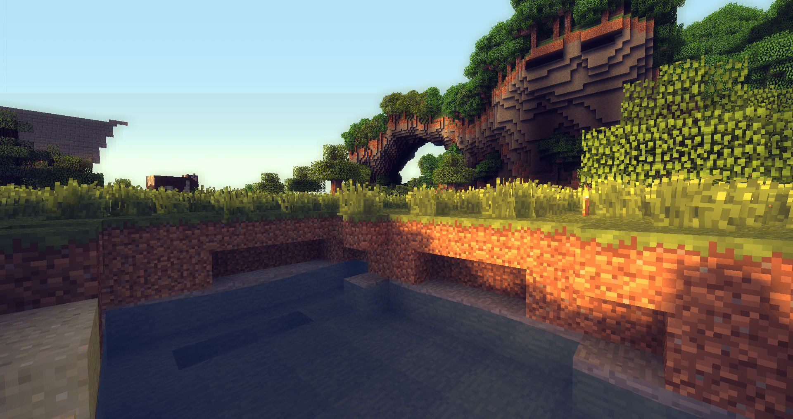
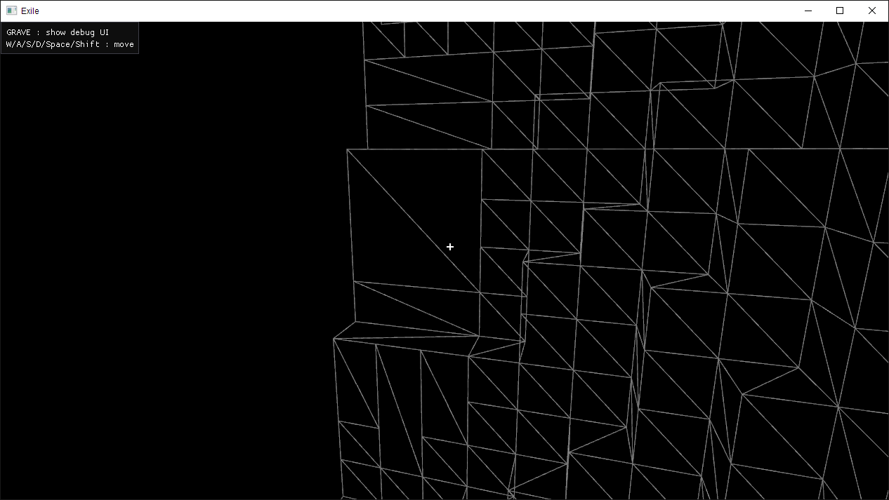

No, [Exile](https://github.com/TheNumbat/exile) is not technically a "voxel" engine. A real voxel engine unifies objects, textures, and more into colored voxel data, rendering them via raymarching/[marching cubes](https://en.wikipedia.org/wiki/Marching_cubes)/[dual contouring](https://upvoid.com/devblog/2013/05/terrain-engine-part-1-dual-contouring/)/etc., and can target realism. Instead, Exile is a "voxel" engine in that it's a traditional 3D engine that happens to focus on representing and drawing textured cubes (like Minecraft and related games). Some have worked around this linguistic confusion by christening the technique ["Swedish cubes"](https://yave.handmade.network/), but for the purposes of this post, please assume that voxels imply textured cubes.

## Voxels

Representing a game world with voxels provides several distinct advantages:

Interactivity: Voxels provide an obvious way for the player to build, edit, and destroy the world however they wish.

Systems: Having a natural world grid allows procedural generation, NPCs, logistic systems, and the like to seamlessly integrate into the environment.
	
Performance: Many optimizations (lighting, meshing, AO, culling, pathing, etc.) are available when working with voxel data, resulting in good performance scaling.

Aesthetics: Subjectively, voxel worlds can look more better from farther distances than traditional mesh-based worlds while being more compact.

Of course, voxels are not without some disadvantages:
- Not for realism, and can look unnatural when mixed with non-voxel elements.
- No [natural LOD](https://0fps.net/2018/03/03/a-level-of-detail-method-for-blocky-voxels/) algorithm (though [there is](http://transvoxel.org/) for marching cubes).
- Likely others I haven't run into.

So voxels are cool, but hasn't this already been done by Minecraft, Minetest, Creativerse, FortressCraft, etc? That's not even counting the many games that render voxel worlds with a non-cube asethetic. Well, maybe it has, but I believe there's work to be done in integrating the technical advancements of a variety of techniques, from user interaction and world generation to new representations and graphics techniques. 

One of the motivating factors for this project was frustration with the state of modded Minecraft: as complex and interesting as the game can be, it suffers from countless technical problems, performance bottlenecks, and compatibility issues, all of which could be solved under a new platform built with extensibility and performance as top priorities. This is my aspiration for Exile, but the project has also served as a learning experience: deciding to start from absolute scratch has led me to learn about the interconnected workings of everything in a 3D engine, from platform services to data structures to debug interfaces and voxel worlds.

## World

In Exile, the world is abstractly represented as an infinite (well, ``UINT32_MAX`` x ``UINT32_MAX`` x 511) field of blocks. Block queries can be made at any position in the world. Of course, there's not enough memory on the planet to store that much information, so the world is sparsely populated by 31 x 31 block chunks. When a chunk of the world is needed, for example, because the player is near enough to render it, it is either retrieved from the world (a hash map) or generated and added on-demand.

The following describes how we go from one chunk of voxel data to rendering an output: more detail on how the world is generated, persisted, rendered, and edited will be published in a future post.

## Techniques  

I explored several techniques for rendering the voxel data, and have mostly settled on a hybrid solution.
1. Instancing

	This technique is the simplest and most obvious: instance a single cube mesh for each block you want to render. This works surprisingly well in the optimal case, a uniform checkerboard of blocks (meaning all faces must be rendered). However, given the massive overdraw in normal cases and lack of flexibility, this technique is not very useful in the end.

2. Geometry shaders

	Using geometry shaders to generate raster data encompasses a variety of options, including [generating entire blocks](http://jojendersie.de/rendering-huge-amounts-of-voxels/) (with up to three faces visible) and [generating triangles based on face data](https://yave.handmade.network/blogs/p/2629-compact_cube_meshes,_and_compact_cube_meshes_in_unity). These techniques tend to be the most space-efficient, but suffer in complexity and geometry shader performance.

3. Meshing

	Meshing also encompasses several techniques. The basic idea is to generate a traditional 3D mesh from voxel data. Rendering static meshes is just about the fastest thing a GPU can do, so meshing tends to be the most performant approach&mdash;but can require unacceptable amounts of GPU memory. However, memory limitations may be worked around by using fixed-precision attributes. For example, if all vertices are at integer coodinates within a chunk, the coordinates only need enough bits to cover the size of the chunk&mdash;certainly not a 12-byte vec3. Further, this approach can be combined with geometry shaders to render directly from an optimized mesh of whole-face data rather than triangle/vertex data.

I found the approach with the highest absolute performance to be meshing. However, due to memory and flexibility concerns, what I settled on for Exile is a hybrid meshing/geometry shading pipeline: generate an optimized face mesh for each chunk, then feed the mesh faces (each represented by four compact vertices) through shaders that unpack the vertices, assemble them into a quad, and render them. 

## Meshing

The first step in the voxel rendering pipeline is creating an optimized, render-able mesh from each chunk. This means converting from flat block data to a list of render-able faces. Exile uses a greedy meshing algorithm to both cull invisible faces and combine identical faces into larger blocks, greatly reducing the overall number of quads. Greedy meshing provides a good trade-off between creating compact meshes and latency in (re)generation. I highly recommend reading [this article](https://0fps.net/2012/06/30/meshing-in-a-minecraft-game/) for an exploration of the algorithm.

<em>([Implementation](https://github.com/TheNumbat/exile/blob/master/src/world.cpp#L735))</em>

<em>Result of Greedy Meshing</em>

## Vertex Format

## Vertex Setup

## Ambient Occlusion

## Block Models

## Lighting
